# Práctica: Cifrado asimétrico con gpg y openssl

## Tarea 1: Generación de claves (1 punto)

### 1. Genera un par de claves (pública y privada). ¿En que directorio se guarda las claves de un usuario?

Generaremos el par de claves con el siguiente comando `gpg --gen-key`

Nos pedirá los siguientes datos:
- Nombre y apellido
- Correo electrónico

Después tendremos que darle a O para aceptar y escribir la frase de paso, pero en está tarea la clave no tendrá frase de paso por lo que esto no será necesario, entonce lo dejamos vacío

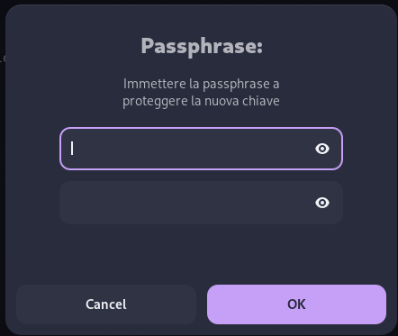

Al dejarla en blanco nos saldrá una advertencia de que no hemos puesto frase pero la ignoramos y selecionamos la segunda opción


Trás hacer esto se nos creará el par de claves

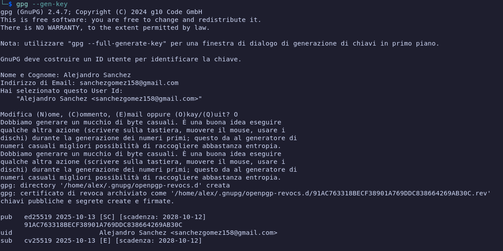


El par de claves se guarda en el directorio **.gnupg** podemos ver donde están listandolas con el comando `ls -la` de la siguiente forma:

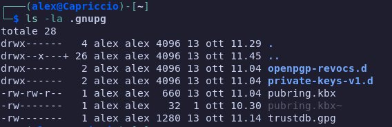

### 2. Lista las claves públicas que tienes en tu almacén de claves. Explica los distintos datos que nos muestra. ¿Cómo deberías haber generado las claves para indicar, por ejemplo, que tenga un 1 mes de validez?

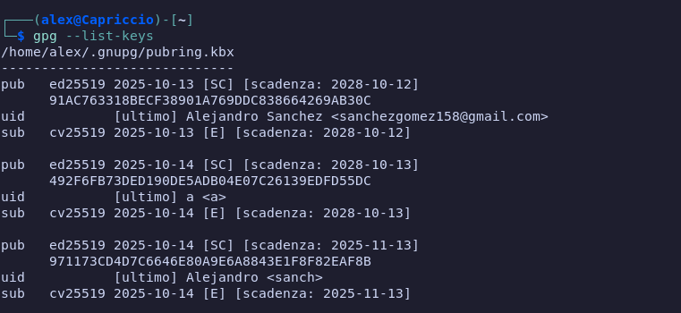


#### 🔹 pub
Indica la **clave pública principal** (*public key*).  
Se usa para **firmar** y **certificar** subclaves o identidades.

#### 🔹 ed25519
Tipo de **algoritmo criptográfico** basado en *curvas elípticas* (Curve25519).  
Es rápido y muy seguro. Se usa principalmente para **firmar**.

#### 🔹 2025-10-14
**Fecha de creación** de la clave.

#### 🔹 [SC]
Indica los **usos permitidos** de la clave principal:
- `S` → **Sign** (Firmar datos o mensajes)  
- `C` → **Certify** (Certificar otras claves o identidades)

#### 🔹 [scadenza: 2025-11-13]
**Fecha de expiración** de la clave (en italiano “scadenza” = caducidad).  
Esta clave deja de ser válida el **13 de noviembre de 2025**.

#### 🔹 971173CD4D7C6646E80A9E6A8843E1F8F82EAF8B
Es la **huella digital (fingerprint)** de la clave pública.  
Sirve para **identificarla de manera única** y verificar su autenticidad.

#### 🔹 uid
Representa el **User ID** o identidad asociada a la clave:

- **Nombre:** Alejandro  
- **Correo:** `<sanchezgomez158@gmail.com>`  
- `[ultimo]` → Es el UID más reciente o activo.

#### 🔹 sub
Indica una **subclave** asociada a la principal.  
Las subclaves se usan para tareas específicas, como cifrado, sin exponer la clave principal.

#### 🔹 cv25519
Algoritmo de **Curve25519** usado en esta subclave para **encriptar (E)**.

#### 🔹 [E]
Uso permitido de la subclave:
- `E` → **Encrypt** (Cifrar/descifrar datos)

#### 🔹 [scadenza: 2025-11-13]
La subclave también **expira el 13 de noviembre de 2025**

- La fecha de caducidad se puede especificar poniendo el comando de creacion extendido `gpg --full-generate-key ` ahi se puede espicificar la fecha de caducidad

### 3. Lista las claves privadas de tu almacén de claves.

Esas se listan con el comando `gpg --list-secret-keys `


## Tarea 2: Importar / exportar clave pública (1 punto)

### 1. Exporta tu clave pública en formato ASCII y guardalo en un archivo nombre_apellido.asc y envíalo al compañero con el que vas a hacer esta práctica.

Exportaremos la clave publica de la siguiente

`gpg --armor --export 91AC763318BECF38901A769DDC838664269AB30C > alejandro_sanchezgomez.asc`


La pasaremos a una maquina virtual por ssh, esta simulara la maquina del compañero

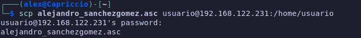

Ya la tendremos en la maquina virtual


### 2. Importa las claves públicas recibidas de vuestro compañero.

Importare mi clave en mi maquina virtual

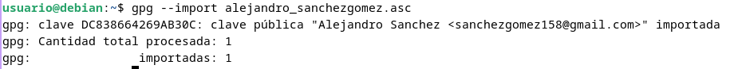

### 3, Comprueba que las claves se han incluido correctamente en vuestro keyring.

Ahora comprobamos que esten en el keyring

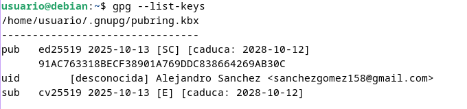

## Tarea 3: Cifrado asimétrico con claves públicas (3 puntos)

### 1. Cifraremos un archivo cualquiera y lo remitiremos por email a uno de nuestros compañeros que nos proporcionó su clave pública.

Generamos el archivo 


Y lo ciframos con la clave publica


### 2. Nuestro compañero, a su vez, nos remitirá un archivo cifrado para que nosotros lo descifremos.

Lo pasamos a la maquina

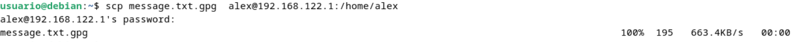

### 3. Tanto nosotros como nuestro compañero comprobaremos que hemos podido descifrar los mensajes recibidos respectivamente.

Y lo desencrptamos con el siguiente comando `gpg --decript`

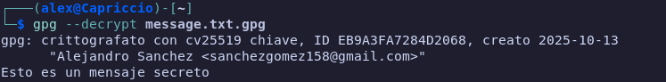

### 4. Por último, enviaremos el documento cifrado a alguien que no estaba en la lista de destinatarios y comprobaremos que este usuario no podrá descifrar este archivo.

Cuando se intenta desecriptar nos muestra lo siguiente

```
gpg: encrypted with 4096-bit RSA key, ID 8843E1F8
gpg: decryption failed: No secret key
```
### 5. Para terminar, indica los comandos necesarios para borrar las claves públicas y privadas que posees.

Para esto usamos el siguiente comando

`gpg --delete-key "ID_DE_LA_CLAVE_PUBLICA"`

`gpg --delete-secret-key "ID_DE_LA_CLAVE_PRIVADA"`

Este paso es irreversible

## Tarea 4: Exportar clave a un servidor público de claves PGP (2 puntos)

### 1. Genera la clave de revocación de tu clave pública para utilizarla en caso de que haya problemas.

Esto se puede hacer de dos formas:

`gpg --gen-revoke "ID"`

o tambien

`gpg --output certificado_de_revocacion.asc --gen-revoke "ID"`

La forma más segura es la segunda, si no ponemos el id al ejecutarlo nos pedira elegirlo

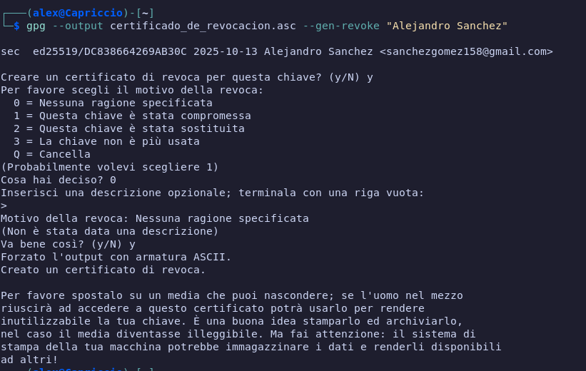

### 2. Exporta tu clave pública al servidor pgp.rediris.es

La exportaremos de la siguiente forma

`gpg --keyserver pgp.rediris.es --send-keys "91AC763318BECF38901A769DDC838664269AB30C"`

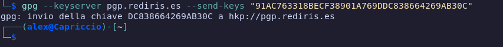

### 3. Borra la clave pública de alguno de tus compañeros de clase e impórtala ahora del servidor público de rediris.

Usaremos el siguiente comando para borrar las claves publicas de mi maquins virtusl ls cual hace de compañero

`gpg --delete-key "id"`

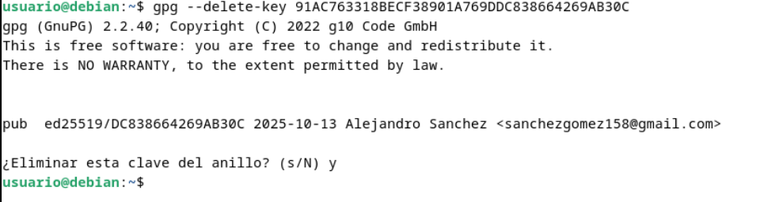

Ahora que la clave publica está borrada, la importaremos nuevamente desde el servidor


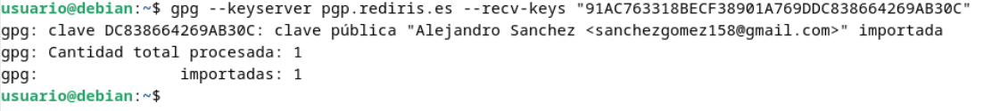


## Tarea 5: Cifrado asimétrico con openssl (3 puntos)

### 1. Genera un par de claves (pública y privada).

Primero crearemos la clave privada con el siguiente comando 

`openssl genrsa -aes256 -out mi_clave_privada.key 4096`

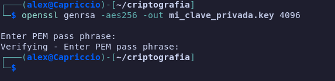

Ahora generaremos la clave pública a traves de la privada

`openssl rsa -in mi_clave_privada.key -pubout -out mi_clave_publica.pub`

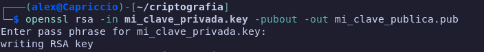

### 2. Envía tu clave pública a un compañero.

- Lo haremos por ssh

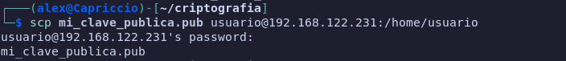

### 3. Utilizando la clave pública cifra un fichero de texto y envíalo a tu compañero.

- Con mi clave publica desde la maquina virtual cifraremos un archivo y nos lo enviaremos 


### 4. Tu compañero te ha mandado un fichero cifrado, muestra el proceso para el descifrado.

Ahora usamos el siguiente comando para descifrar el archivo con mi clave privada

`openssl pkeyutl -decrypt -in mensage_cifrado.enc -inkey mi_clave_privada.key -out mensaje_descifrado.txt`

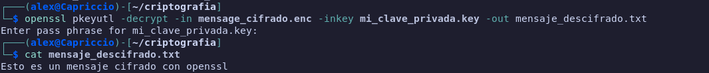

