# Práctica: Integridad, firmas y autenticación

## Tarea 1: Firmas electrónicas (3 puntos)

### 1. Manda un documento y la firma electrónica del mismo a un compañero. Verifica la firma que tu has recibido.

- Primero generamos el documento

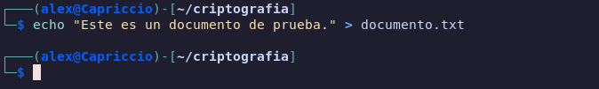

- Ahora lo firmamos


- Al verificar recibimos el siguiente texto

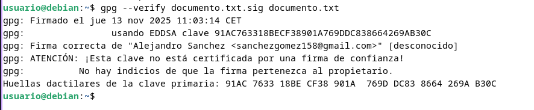

### 2. ¿Qué significa el mensaje que aparece en el momento de verificar la firma?
```
 gpg: Firma correcta de "Pepe D <josedom24@gmail.com>" [desconocido]
 gpg: ATENCIÓN: ¡Esta clave no está certificada por una firma de confianza!
 gpg:          No hay indicios de que la firma pertenezca al propietario.
 Huellas dactilares de la clave primaria: E8DD 5DA9 3B88 F08A DA1D  26BF 5141 3DDB 0C99 55
```

Es una medida de seguridad, nos dice que al no estar la clave publica verificada puede estar siendo firmada por otro que no es el que pone ahi

### 3. Vamos a crear un anillo de confianza entre los miembros de nuestra clase, para ello.

- Tu clave pública debe estar en un servidor de claves
- Escribe tu fingerprint en un papel y dárselo a tu compañero, para que puede descargarse tu clave pública.
- Te debes bajar al menos tres claves públicas de compañeros. Firma estas claves.
- Tu te debes asegurar que tu clave pública es firmada por al menos tres compañeros de la clase.
- Una vez que firmes una clave se la tendrás que devolver a su dueño, para que otra persona se la firme.
- Cuando tengas las tres firmas sube la clave al servidor de claves y rellena tus datos en la tabla Claves públicas PGP 2020-2021
- Asegurate que te vuelves a bajar las claves públicas de tus compañeros que tengan las tres firmas.


---

- Empezaremos por subir mi clave pública a un servidor de claves 

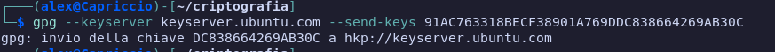

- Ahora obtenemos el fingerprint para pasarselo al compañero

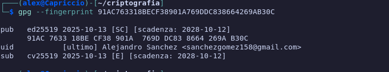

Mi fingerprint es `91AC 7633 18BE CF38 901A 769D DC83 8664 269A B30C`

- Desde mi maquina virtual descargo la clave publica 

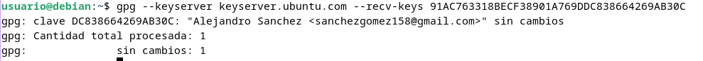

- Y la firmamos

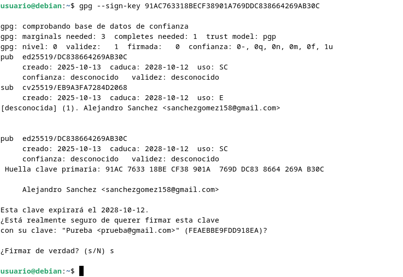

- La exportamos y nos la pasamos

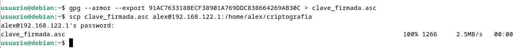

- Ahora la importamos

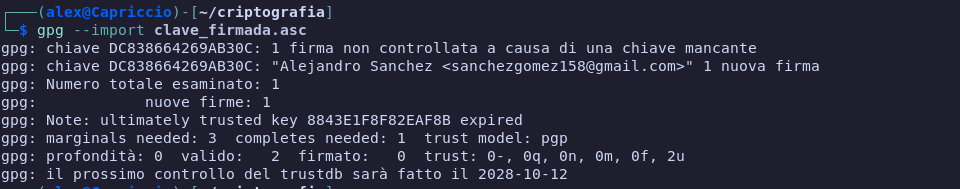

- Hacemos lo mismo con otras dos más

### 4. Muestra las firmas que tiene tu clave pública.

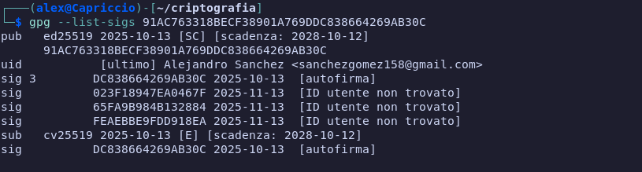

### 5. Comprueba que ya puedes verificar sin “problemas” una firma recibida por una persona en la que confías.

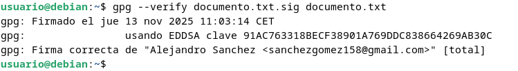

### 6. Comprueba que puedes verificar con confianza una firma de una persona en las que no confías, pero sin embargo si confía otra persona en la que tu tienes confianza total.

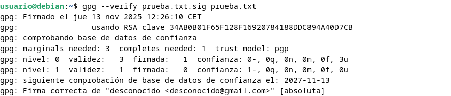

## Tarea 2: Correo seguro con evolution/thunderbird (2 puntos)

Ahora vamos a configurar nuestro cliente de correo electrónico para poder mandar correos cifrados, para ello:


### 1. Configura el cliente de correo evolution con tu cuenta de correo habitual

- Lo unico que hay que hacer es abrir evolytion y poner nuestro nombre y el correo, y ya estará configurado

### 2. Añade a la cuenta las opciones de seguridad para poder enviar correos firmados con tu clave privada o cifrar los mensajes para otros destinatarios

- Para añadir la clave de seguridad primero tenemos que abrir evolution

- Pulsamos ctrl+shift+s y se nos abrira la pestaña de preferencias

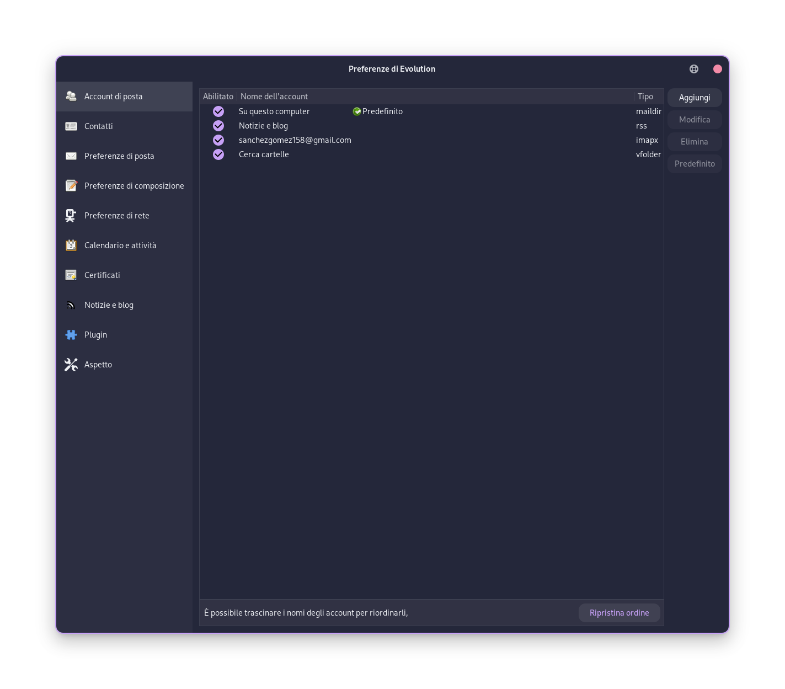

- Seleccionamos el correo y se nos abrira otra pestaña

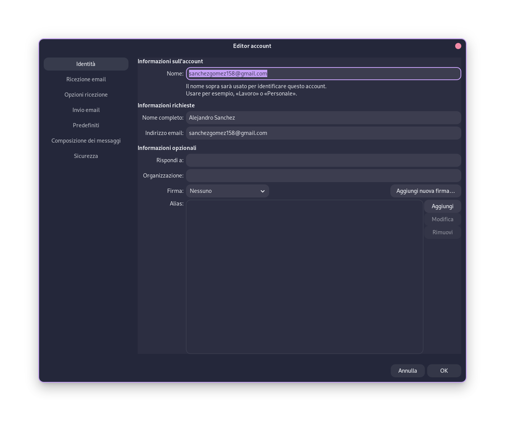

- Seleccionamos securidad

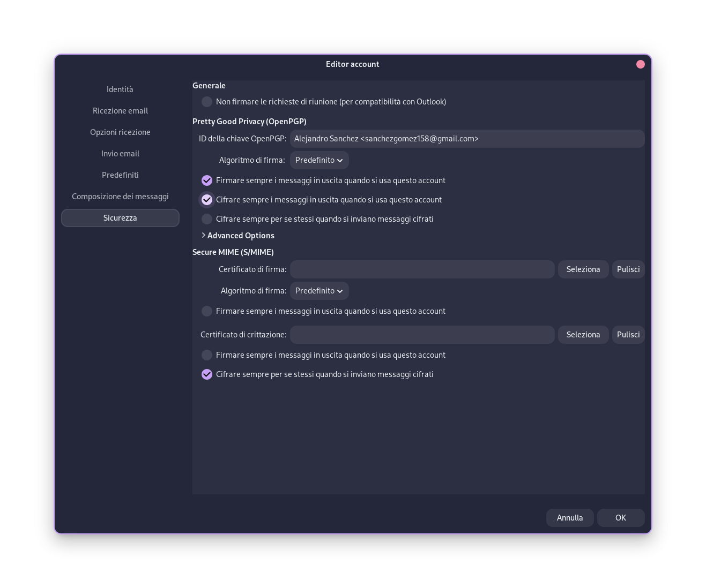

- Ponemos el id de nuestra clave y selecionamos que se firme y se cifre siempre que se use esta cuenta

- Ahora enviamos un correo hacia la otra cuenta (aleeex.lmd@gmail.com)

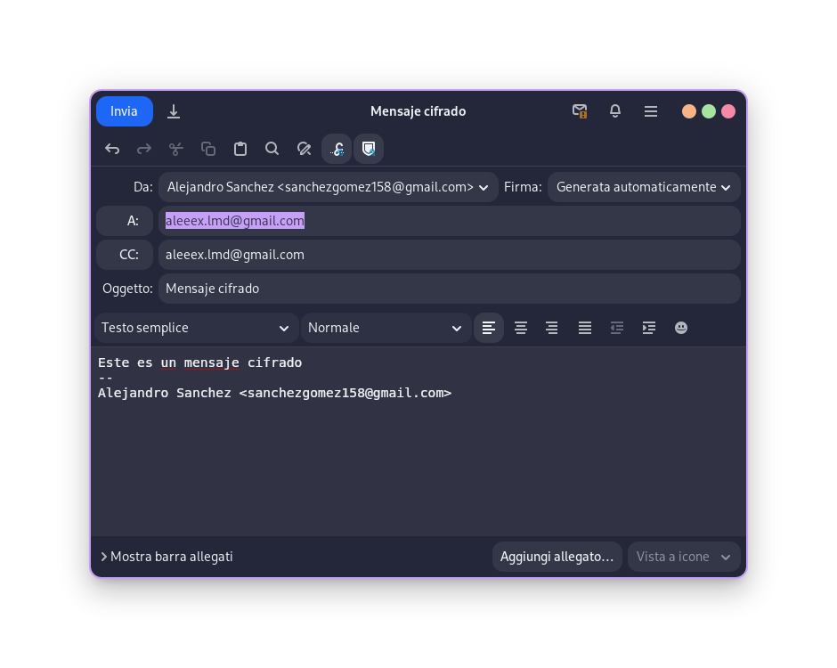

- Al recibirlo se vé de la siguiente forma


## Tarea 3: Integridad de ficheros (1 punto)

Vamos a descargarnos la ISO de debian, y posteriormente vamos a comprobar su integridad.

Puedes encontrar la ISO en la dirección: https://cdimage.debian.org/debian-cd/current/amd64/iso-cd/.

### 1. Para validar el contenido de la imagen CD, solo asegúrese de usar la herramienta apropiada para sumas de verificación. Para cada versión publicada existen archivos de suma de comprobación con algoritmos fuertes (SHA256 y SHA512); debería usar las herramientas `sha256sum` o `sha512sum` para trabajar con ellos.

- Descargamos la iso y los archivos oficiales para la firma y la suma

```
wget https://cdimage.debian.org/debian-cd/current/amd64/iso-cd/SHA256SUMS
wget https://cdimage.debian.org/debian-cd/current/amd64/iso-cd/SHA256SUMS.sign
wget https://cdimage.debian.org/debian-cd/current/amd64/iso-cd/SHA512SUMS
wget https://cdimage.debian.org/debian-cd/current/amd64/iso-cd/SHA512SUMS.sign
```

- Ahora las validamos el contenido

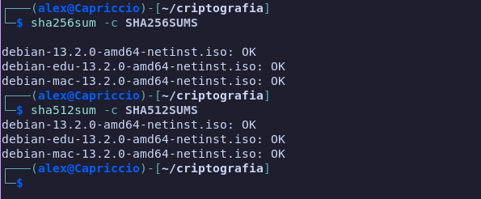

- Como podemos ver está todo bien

### 2. Verifica que el contenido del hash que has utilizado no ha sido manipulado, usando la firma digital que encontrarás en el repositorio. Puedes encontrar una guía para realizarlo en este artículo: [How to verify an authenticity of downloaded Debian ISO images](https://linuxconfig.org/how-to-verify-an-authenticity-of-downloaded-debian-iso-images)

- Verificamos que no han sido manipuladas con el siguente comando

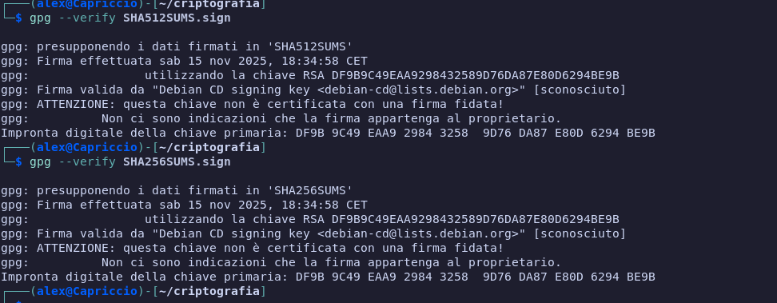

- Si no sale eso es porque hay que importar la clave

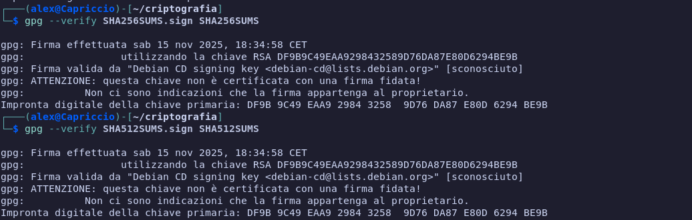

- Como vemos esta correcta


## Tarea 4: Integridad y autenticidad (apt secure) (2 puntos)Permalink

Cuando nos instalamos un paquete en nuestra distribución linux tenemos que asegurarnos que ese paquete es legítimo. Para conseguir este objetivo se utiliza criptografía asimétrica, y en el caso de Debian a este sistema se llama apt secure. Esto lo debemos tener en cuenta al utilizar los repositorios oficiales. Cuando añadamos nuevos repositorios tendremos que añadir las firmas necesarias para confiar en que los paquetes son legítimos y no han sido modificados.

Busca información sobre apt secure y responde las siguientes preguntas:

### 1. ¿Qué software utiliza apt secure para realizar la criptografía asimétrica?

- Apt secure usa gpg para el cifrado asimétrico

### 2.¿Para que sirve el comando apt-key? ¿Qué muestra el comando apt-key list?

- El comando apt-key sirve para añadir, eliminar y enumerar las claves publicas para peritir al sistema verificar la autenticidad del paquete de software descargado de un repositorio externo


- La salida del comando apt-key list es la siguiente

```
$ apt-key list
/etc/apt/trusted.gpg
--------------------
pub   rsa4096 2019-04-14 [SC]
      6D33866EDD8FFA41C0143AEDDCC9EFBF77E11517
uid           [ unknown] Debian Archive Automatic Signing Key (10/buster) <ftpmaster@debian.org>

pub   rsa4096 2021-08-11 [SC]
      73A4F27B8DD47936E8E4B06F4D9D6B20F5765F97
uid           [ unknown] Debian Security Archive Automatic Signing Key (11/bullseye) <ftpmaster@debian.org>

pub   rsa4096 2021-08-11 [SC]
      665FFB5AF711916F83FAEF9BFDDBCE708F5C6B8E
uid           [ unknown] Debian Archive Automatic Signing Key (11/bullseye) <ftpmaster@debian.org>

pub   rsa4096 2022-03-19 [SC]
      0E98404D386FA1D9A79A0A33F03C2D5D3DF92BD8
uid           [ unknown] Debian Stable Release Key (12/bookworm) <debian-release@lists.debian.org>

/etc/apt/trusted.gpg.d/debian-archive-bullseye-keyring.gpg
---------------------------------------------------------

pub   rsa4096 2021-08-11 [SC]
      73A4F27B8DD47936E8E4B06F4D9D6B20F5765F97
uid           [ unknown] Debian Security Archive Automatic Signing Key (11/bullseye) <ftpmaster@debian.org>
```

En la primera linea muestra el tipo de clave, el tipo de algoritmo usado junto al tamaño y la fecha de creacion de esta

En la segunda linea muestra el id de la clave primaria

En la tercera linea muestra a que pertenece

### 3. En que fichero se guarda el anillo de claves que guarda la herramienta apt-key?
El anillo de claves se guarda en el fichero `/etc/apt/trusted.gpg` 

### 4. ¿Qué contiene el archivo Release de un repositorio de paquetes?. ¿Y el archivo Release.gpg?. Puedes ver estos archivos en el repositorio http://ftp.debian.org/debian/dists/Debian10.1/. Estos archivos se descargan cuando hacemos un apt update.

El archivo Release contiene lo siguiente:

1. Metadatos de la distribucion: codename (es el nombre de la version), versión, componentes (main, contrib, non-free), arquitecturas soportadas, fecha, origen.

2. Los archivos de esta distribucion junto a su suma y a su clave de vericicacion (para varias versiones)

3. Tambien incluye informacion que ayuda a apt a conocer los archivos de ese repositorio

El archivo Release.gpg contiene la firma digital del archivo Release

### 5. Explica el proceso por el cual el sistema nos asegura que los ficheros que estamos descargando son legítimos.

Cuando haces un apt update los archivos que se vayan a instalar se buscan el los repositorios que estan en release y se verifican con la suma y la firma de release.pgp

Al hacer un apt install se instalan los .deb de esos archivos que se vayan a intalar y se verifican los hashes para confirmar que los archivos no han sido modificados

### 6. Añade de forma correcta el repositorio de virtualbox añadiendo la clave pública de virtualbox como se indica en la documentación.

En `/etc/apt/sources.list` debemos añadir la siguiente linea:

`deb [arch=amd64 signed-by=/usr/share/keyrings/oracle-virtualbox-2016.gpg] https://download.virtualbox.org/virtualbox/debian trixie contrib`

Ahora descargamos y registramos la clave de oracle para que se puede verificar

`wget -O- https://www.virtualbox.org/download/oracle_vbox_2016.asc | sudo gpg --yes --output /usr/share/keyrings/oracle-virtualbox-2016.gpg --dearmor`

- Como podemos ver al hacer apt update se descargan los datos de eserepositorio, lo que significa que funciona bien.

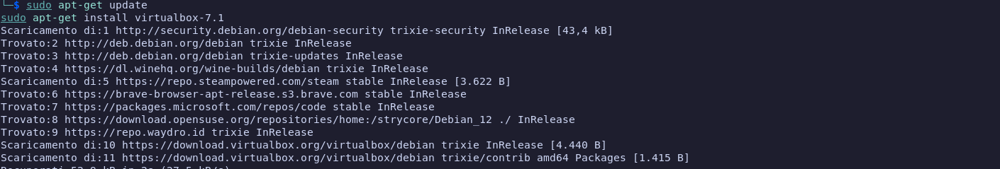

## Tarea 5: Autentificación: ejemplo SSH (2 puntos)
Vamos a estudiar como la criptografía nos ayuda a cifrar las comunicaciones que hacemos utilizando el protocolo ssh, y cómo nos puede servir también para conseguir que un cliente se autentifique contra el servidor. Responde las siguientes cuestiones:

### 1. Explica los pasos que se producen entre el cliente y el servidor para que el protocolo cifre la información que se transmite? ¿Para qué se utiliza la criptografía simétrica? ¿Y la asimétrica?

1. Primero, el cliente le dice al servidor su versión para ver si son compatibles. Si lo son, sigue la conexión.  
2. Luego hacen un intercambio de claves y eligen el algoritmo más seguro que los dos puedan usar.  
3. Se genera un código secreto para la sesión, diferente para cada parte.  
4. El servidor usa su **clave privada** para firmar parte de los datos, y el cliente verifica la firma con la **clave pública** del servidor. Si es la primera vez que te conectas, te pedirá confirmar y guardar la clave del servidor.  
5. Después, con todo esto se genera la **clave de sesión simétrica**, que se usará para cifrar y descifrar los datos mientras dura la conexión.  

Criptografía que se usa
- **Asimétrica:** se usa para el intercambio seguro de claves y para autenticar al servidor.  
- **Simétrica:** se usa para cifrar la comunicación real, porque es más rápida.  


### 2. Explica los dos métodos principales de autentificación: por contraseña y utilizando un par de claves públicas y privadas.

- Por contraseña:
      1. despues de que el canal cifrado esté activo, el servidor le pide una contraseña al usuario.
      2. El usuario ingresa la contraseña desde el cliente.
      3. El cliente envia la contraseña al cliente. Esta se transmite de forma segura ya que la comunicacion esta cifrada por la clave de sesion establecida anteriormente
      4. El servidor compara la contraseña reciboda con el has de la contraseña que se encuentra en `/etc/shadow`
      5. Si el hash correponde se permite el acceso


- Por par de claves:
      1. El usuario debe generar una cupia de su clave en el cliente.
      2. Esta clave publica debe ser guardada en el fichero `~/.ssh/authorized_keys`
      3. Cuando el cliente intenta conectarse el server crea un mensaje random
      4. Este mensaje es enviado al cliente.
      5. El cliente usa su claveprivada para firmar el mensaje y lo envia al server
      5. El server usa la clave publica guardada en el fichero anterior para verificar la firma
      6. Si la verificacion es correcta significa que el cliente posee la clave privada correcta y se permite el acceso

### 4. ¿Qué significa este mensaje que aparece la primera vez que nos conectamos a un servidor?

```
 $ ssh debian@172.22.200.74
 The authenticity of host '172.22.200.74 (172.22.200.74)' can't be established.
 ECDSA key fingerprint is SHA256:7ZoNZPCbQTnDso1meVSNoKszn38ZwUI4i6saebbfL4M.
 Are you sure you want to continue connecting (yes/no)? 
```

El cliente te pide confirmacion para guardar la clave publica del host

### 5. En ocasiones cuando estamos trabajando en el cloud, y reutilizamos una ip flotante nos aparece este mensaje:
```
 $ ssh debian@172.22.200.74
 @@@@@@@@@@@@@@@@@@@@@@@@@@@@@@@@@@@@@@@@@@@@@@@@@@@@@@@@@@@
 @    WARNING: REMOTE HOST IDENTIFICATION HAS CHANGED!     @
 @@@@@@@@@@@@@@@@@@@@@@@@@@@@@@@@@@@@@@@@@@@@@@@@@@@@@@@@@@@
 IT IS POSSIBLE THAT SOMEONE IS DOING SOMETHING NASTY!
 Someone could be eavesdropping on you right now (man-in-the-middle attack)!
 It is also possible that a host key has just been changed.
 The fingerprint for the ECDSA key sent by the remote host is
 SHA256:W05RrybmcnJxD3fbwJOgSNNWATkVftsQl7EzfeKJgNc.
 Please contact your system administrator.
 Add correct host key in /home/jose/.ssh/known_hosts to get rid of this message.
 Offending ECDSA key in /home/jose/.ssh/known_hosts:103
   remove with:
   ssh-keygen -f "/home/jose/.ssh/known_hosts" -R "172.22.200.74"
 ECDSA host key for 172.22.200.74 has changed and you have requested strict checking.
 ```

 Esto sucede proque al hacer conexion ssh, el el cliente se guarda la clave publica del server y su ip en el fichero de known_hosts para que las proximas veces sea mas rapido el proceso de conexion, pero si se usa la ip en otra maquina, esa ip sigue guardada con la clave publica de la maquina anterior y da error, por lo que se pide que se borre del fichero esa linea

### 6. ¿Qué guardamos y para qué sirve el fichero en el servidor `~/.ssh/authorized_keys`?

En ese fichero se añaden las claves publicas de los clientes que queramos que se puedan unir a nuestro servidor usando un par de claves