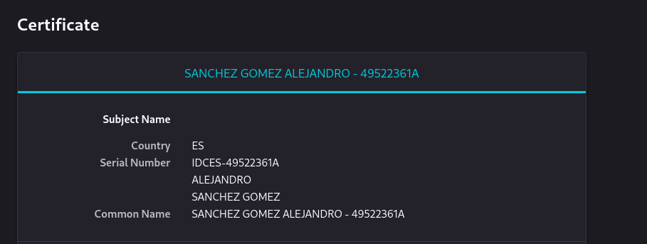
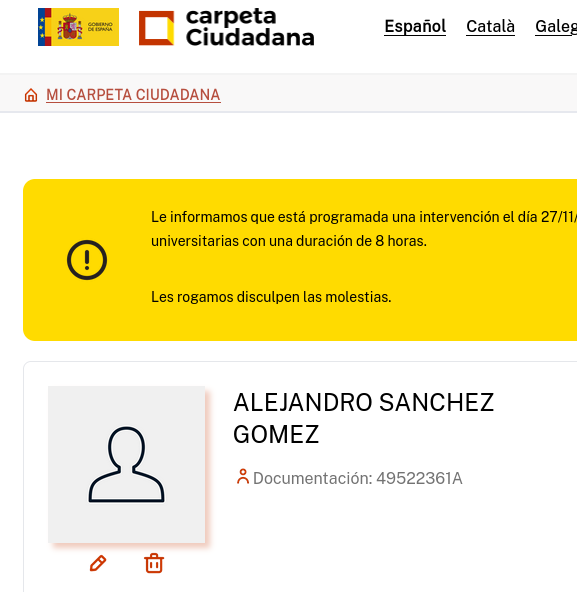

# Práctica: Certificados digitales. HTTPS

## Tarea 1: Instalación del certificado

### 1. Una vez que hayas obtenido tu certificado, explica brevemente como se instala en tu navegador favorito.

- Primero tenemos que tener descargado el certificado, un archivo .p12

- Usaremos el navegador firefox, nos iremos a los ajustes

- Bajamos a la zona de seguridad, y de damos a gestionar certificados

- Por ultimo importamos el nuestro y ponemos la contraseña

### 2. Muestra una captura de pantalla donde se vea las preferencias del navegador donde se ve instalado tu certificado.



### 3. ¿Cómo puedes hacer una copia de tu certificado?, ¿Como vas a realizar la copia de seguridad de tu certificado?. Razona la respuesta.
Para hacer la copia simplemente copias el archivo y lo pegas donde haga falta

Para la copia de seguridad, primero lo cifraremos y luego lo subiremos a la nube

`gpg --symmetric --cipher-algo AES256 certificado.p12`

Para descifrarlo se hace de la siguiente forma

`gpg -d certificado.p12.gpg > certificado.p12`


### 4. Investiga como exportar la clave pública de tu certificado.


Un archivo `.p12` (o `.pfx`) contiene:
1. Tu **certificado** (identifica tu persona)
2. Tu **clave privada** (secreta, nunca compartir)
3. Posiblemente certificados de la CA (intermedios)

Para obtener **solo la clave pública**, seguimos dos pasos.

1. Extraer el certificado público del .p12

```
openssl pkcs12 -in certificado.p12 -clcerts -nokeys -out certificado_publico.pem
```
Qué hace cada opción:

```
-in certificado.p12 → lee tu archivo .p12

-clcerts → extrae solo el certificado de usuario, no los certificados de la CA

-nokeys → no extrae la clave privada

-out certificado_publico.pem → guarda el certificado en formato PEM legible
```

2. Extraer la clave pública del certificado

```
openssl x509 -in certificado_publico.pem -pubkey -noout > clave_publica.pem
```

Qué hace cada opción:

```
-in certificado_publico.pem → abre el certificado que acabamos de extraer

-pubkey → extrae solo la clave pública

-noout → no muestra el resto del certificado

> clave_publica.pem → guarda la clave pública en un archivo llamado clave_publica.pem
```

## Tarea 2: Validación del certificado

### 1. Instala en tu ordenador el software autofirma y desde la página de VALIDe valida tu certificado. Muestra capturas de pantalla donde se comprueba la validación.


## Tarea 3: Firma electrónicaPermalink

### 1.Utilizando la página VALIDe y el programa autofirma, firma un documento con tu certificado y envíalo por correo a un compañero.

Firmamos una archivo y se lo enviamos a un compañero por correo

### 2. Tu debes recibir otro documento firmado por un compañero y utilizando las herramientas anteriores debes visualizar la firma (Visualizar Firma) y (Verificar Firma). ¿Puedes verificar la firma aunque no tengas la clave pública de tu compañero?, ¿Es necesario estar conectado a internet para hacer la validación de la firma?. Razona tus respuestas.
- Puedes ver lo siguiente al visualizar:
    - Quién la firmó
    - Fecha y hora de la firma
    - Estado de validez de la firma

- Para verificar se necesita su clave publica

- La firma se ve sin conexión a internet, pero para validarlo se necesita la conexion a iternet

### 3. Entre dos compañeros, firmar los dos un documento, verificar la firma para comprobar que está firmado por los dos.
Al verificar se ven lo de las dos personas que la firmaron


## Tarea 4: Autentificación

### 1. Utilizando tu certificado accede a alguna página de la administración pública )cita médica, becas, puntos del carnet,…). Entrega capturas de pantalla donde se demuestre el acceso a ellas.

